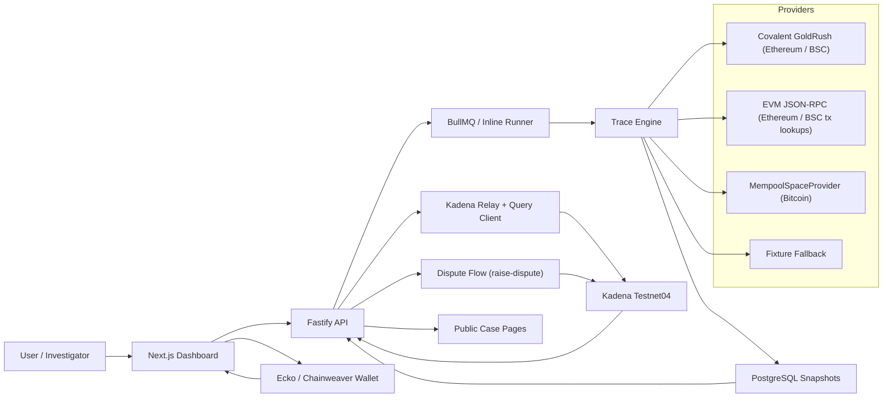

# KadenaTrace Architecture

## Separation of concerns

- Off-chain
  - transaction ingestion
  - recursive graph expansion
  - Bitcoin address activity via mempool.space
  - bridge continuation handling
  - heuristic scoring
  - shareable case assembly
- On-chain
  - immutable case IDs
  - timestamped event log
  - public wallet risk attestations
  - dispute defpact state transitions
  - verification of hashes and public metadata URIs

## Key architecture decisions

**Why hashes, not raw data, go on-chain:**
The Pact contract stores SHA-256 hashes of case metadata and public URIs, not the underlying wallet addresses or investigation details. This means on-chain data alone cannot identify victims or attackers — it only proves that a specific investigation existed at a specific block height and that its content has not changed.

**Why the relay pattern instead of direct wallet gas:**
The API prepares unsigned Pact transactions; the browser wallet signs them locally. The API relay submits and listens. This means the server never holds private keys, and the on-chain signer is always the investigator's own account — not a backend key.

**Why BullMQ over a simple async queue:**
BullMQ provides job retry, stalled-job recovery, and per-job rate limiting. A trace that fails due to a transient API timeout is automatically retried without losing the request.

**Why mempool.space for Bitcoin:**
The API requires no API key, is open-source, and returns UTXO-level data that maps directly to the NormalizedTransfer model. The provider can be overridden via BITCOIN_MEMPOOL_URL for self-hosted nodes.

## Threat model and limitations

- **KadenaTrace is an investigation tool, not a sanctions oracle.** Risk scores are heuristic estimates, not legal determinations.
- **The fixture provider cannot detect new attacks.** Real investigations require a Covalent or RPC API key.
- **On-chain attestations are immutable.** A mistakenly anchored case cannot be deleted — only disputed via raise-dispute.
- **The dispute defpact is not yet surfaced in the frontend.** It exists in the Pact contract and can be invoked via the REPL or a direct Pact transaction.

## Live signing flow

1. The API prepares an unsigned Pact transaction for `create-case` or `attest-wallet-risk`.
2. The browser wallet signs the command locally using Ecko or Chainweaver Legacy.
3. The signed command is posted back to the API relay.
4. The relay preflights, submits, and listens for the Kadena result.
5. The confirmed request key and block height are persisted into the public case record.
